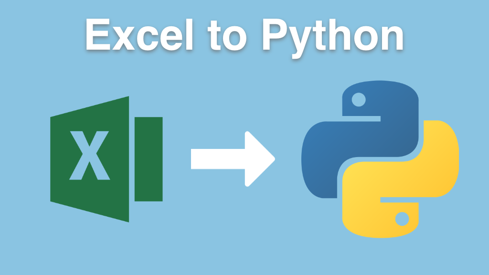

# Move from Excel to Python with Pandas

Student materials and handouts for Excel to Python course

## Register for the course

Take the course at Talk Python Training: [**training.talkpython.fm/courses/move-from-excel-to-python-and-pandas**](https://training.talkpython.fm/courses/move-from-excel-to-python-and-pandas)

## Course Summary

If you work with Excel and have ever thought - "there has to be a better way" then this course is for you! Excel has been used to automate and power businesses and solve business users' problems for years. But there are many drawbacks with relying so heavily on Excel for your data processing needs. In this course, you will see how Python's modern data science libraries will allow you to solve the same problems while avoiding the pitfalls and limitations inherent in Excel.

## What's this course about and how is it different?

This course will teach you how to use Python to **replace your tedious and error-prone Excel actions**. This course is designed to **quickly build your Python and pandas knowledge** so that you can leverage the power and efficiency of Python in your day to day work. This course is unique in that it shows common Excel tasks and **translates them to Python code**.

If you have ever been curious about how Python can immediately impact your daily job but have been unsure where to start - this course is for you!

## What topics are covered

In this course, you will:

- Learn about the typical challenges with Excel and how Python is a better alternative for many tasks
- See all steps needed to install Python and **setup your workspace**
- **Create and use Conda environments**
- Learn about **Windows specific-tricks** for efficiently working with Python
- See how the Jupyter notebook can be a streamlined environment for working with data
- Learn about the **pandas DataFrame** and how to use it for data analysis
- Use pandas to read in CSV and Excel files
- Efficiently **clean and manipulate large sets of data**
- Perform mathematical operations with pandas
- Discover how to work with dates and other data types in pandas
- Group and **summarize large data sets** using powerful pandas commands such as `groupby` and `pivot_table`
- Combine data by merging and concatenating multiple DataFrames
- Read multiple file types and **create formatted Excel workbooks**
- And much more

View the [full course outline](https://training.talkpython.fm/courses/move-from-excel-to-python-and-pandas).

## Who is this course for?

This course is designed for **anyone that uses Excel** in their day to day work and is interested in **working more efficiently with Python**. If you have tried to learn Python in the past and struggled, this course will help you understand Python using common Excel tasks as a reference.

This course is best for a student that has experience with some basic Python concepts:

- Importing modules
- Assigning variables
- Working with lists and dictionaries
- Creating and using functions

**Note**: All software used during this course, including editors, Python language, etc., are 100% free and open source. You won't have to buy anything to take the course.

## The time to act is now

If you have struggled with repetitive tasks in Excel and have been looking to learn how to use Python, then this course is designed for you. After completing this course, you will have a fully functional Python environment and have enough pandas knowledge to perform meaningful and impactful analysis.

Dive into Excel to Python and level up your skills. Join today! You've got nothing to lose. Every one of our courses comes with a 2-week money-back guarantee.

[Register for the course today](https://training.talkpython.fm/courses/move-from-excel-to-python-and-pandas).